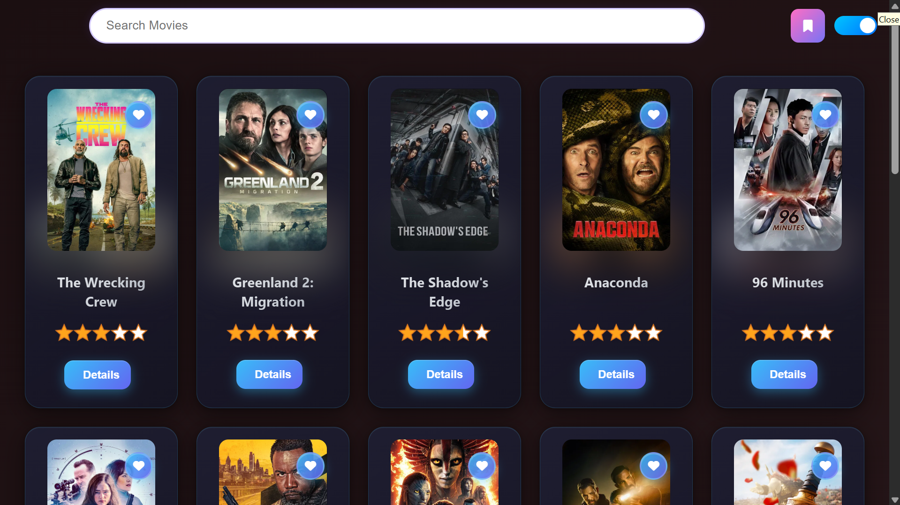
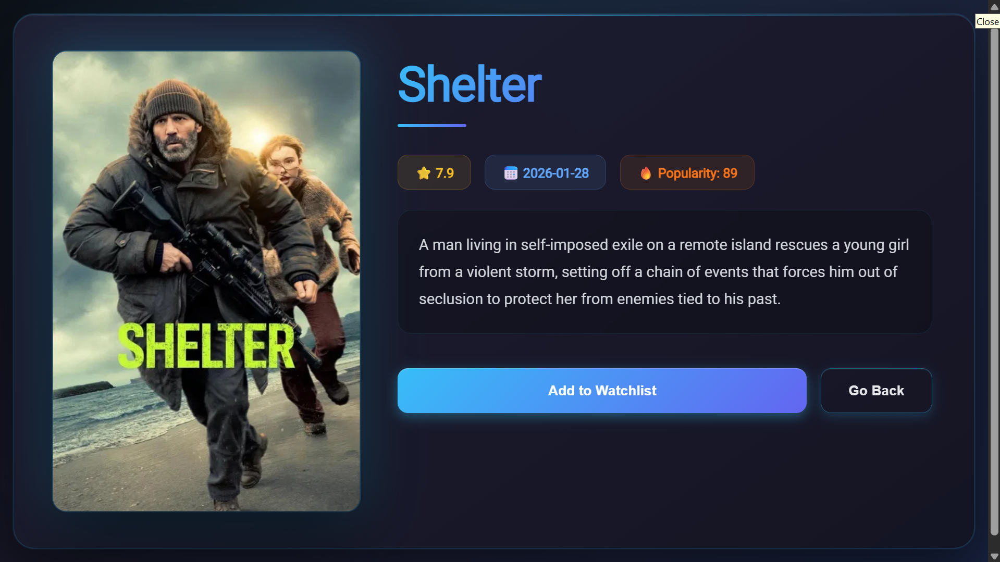
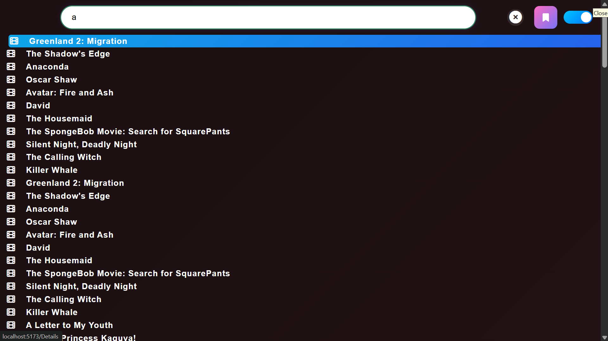
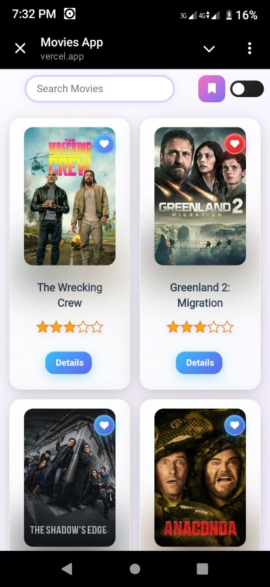

# 🎬 Movie App
📁 Source code is inside the `movie-app/` folder.
A responsive frontend movie application that allows users to discover popular movies, search for titles, and view detailed movie information.  
This project focuses on building a clean UI, working with external APIs, and improving frontend development skills.

🔗 **Live Demo:** https://movie-app-theta-steel.vercel.app/

---

## ✨ Features

- Browse popular and trending movies
- Search movies by title
- View movie details (overview, rating, release date, poster)
- Responsive design for mobile and desktop
- Fast and smooth user experience

---

## 🛠️ Tech Stack

- **React**
- **JavaScript (ES6+)**
- **CSS**
- **Movie Database API (TMDB)**
- **Vercel** (Deployment)

---
## 📸 Screenshots

| Home Page | Movie Details |
|----------|---------------|
|  |  |

| Search | Mobile View |
|--------|-------------|
|  |  |

